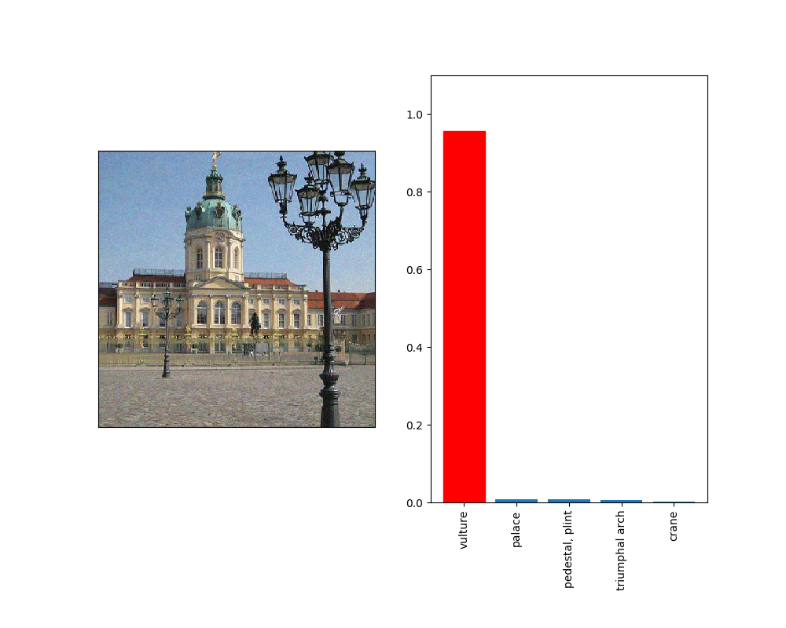

# Circumventing Ensemble Adversarial Training

 

## Intro
Neural networks are known to be susceptible to adversarial examples, small perturbations that induce misclassification by otherwise well-performing classifiers [4].  When discussing the creation of adversarial examples or techniques for defending against them, it is important to specify _threat model_ under which the attacks or defenses operate; that is, what we are to assume an attack has or lacks access to. The first adversarial examples were considered under what we now denote the "white-box" threat model, where the details, weights, and therefore gradients of the network being attacked are available to an attacker. However, many attacks or defenses have been proposed in the "black-box" threat model, which is when the adversary can "only interact with a model’s prediction interface" [1]. One popular _attack method_ in the black-box case is to use a substitute network; essentially the adversary trains a surrogate network for the one they wish to attack by using input/output pairs from the original, then attacks the surrogate network using standard first-order attacks like PGD [3].

 Ensemble Adversarial Training [1] is a method proposed for defending against adversarial examples in the black-box case proposed in a recent paper (to appear in ICLR 2018). In the paper, the model is claimed to be secure against the black-box _threat model_; the paper then proves a series of theorems about the method's effectiveness against a "black-box adversary," which is defined explicitly as a substitute network. Here, we show that though secure against the specific _attack method_ of substitute networks, the method is effectively circumvented by the use of the Gradient Estimation+Finite Differences attack given in [2].

## Results and examples:

- We blindly choose 50 images from the ImageNet dataset. Of these, we
  discard four originally misclassified images, since this are ineligible
for the partial-information attack.
- For the remaining 46, we choose a target class uniformly at random, and
  run the partial-information black-box attack with &#x3B5; = 0.05 *(Note
that this is a targeted attack)*
- **100%** of the constructed images fool the ensemble adversarial training
  classifier
- See `sample_images/` for all the generated images.

## Code
The code is all available! To run it yourself:
1. Clone the repo
2. Download and untar the following checkpoint: `http://download.tensorflow.org/models/ens4_adv_inception_v3_2017_08_18.tar.gz` and move it into the `data/` folder
3. `cd` into the `data/` folder and run `python model_convert.py $CHECKPOINT_NAME model_v1.ckpt` (this just converts the checkpoint back to a Saver-v1 version because that's what the code is designed to read)
4. Open the file `pi-nes.py,` and change `IMAGENET_PATH` to be the path to the imagenet dataset on your computer (if you don't have the ImageNet dataset downloaded and don't want to download it, you're welcome to override the `get_image` function in `pi-nes.py` to load (image, label) pairs from wherever you want (images should be 299x299x3)
5. To run with the default parameters, first run `pip install -r requirements.txt`, then simply `python pi-nes.py $INDEX` where $INDEX will be the imagenet image that is adversarially modified.
6. Check `adv_example/` directory (or whatever you set `OUT_DIR` to in `pi-nes.py`) for the results! For reference, we've included our results from running `python pi-nes.py 1234`.

## Observations and Conclusions:
First, I ran the authors' code and verified the results of the paper, which are not to be understated; the model is in fact quite robust to the substitute networks constructed. However, the effectiveness of white-box methods and particularly even coarse ones such as FGSM, suggests that a gradient-estimation attack might be the best way to proceed. Applying standard NES, interestingly, was not enough---it seems that the model has learned some first-order robustness as well, as gradient descent with NES estimates causes the adversary to get caught in plenty of plateaus, local minima, and regions with very little gradient signal. Rather than try to circumvent this with regularization/random restarts/other optimizations, we instead apply the partial-information attack from [2], (see the blog post [here](http://www.labsix.org/partial-information-adversarial-examples/), and manage to effectively construct adversarial examples even in a black-box setting. __Note that this does not invalidate any of the _formal_ claims made in [1], but instead shows that a defense that's robust to a *particular* black-box attack isn't necessarily secure in the black-box threat model. Defenses claimed to be black-box-secure benefit from being evaluated under a number of different black-box attack strategies, including substitute networks as well as the techniques presented here.

## Citation
If you use this implementation in your work, please cite the following:

```
@misc{ilyas2018ensattack,
  author = {Andrew Ilyas},
  title = {Circumventing the Ensemble Adversarial Training Defense},
  year = {2018},
  howpublished = {\url{https://github.com/andrewilyas/ens-adv-train-attack}}
}
```

[1] https://arxiv.org/abs/1705.07204 <br />
[2] https://arxiv.org/abs/1712.07113 <br />
[3] https://arxiv.org/abs/1706.06083 <br /> 
[4] https://arxiv.org/abs/1312.6199
